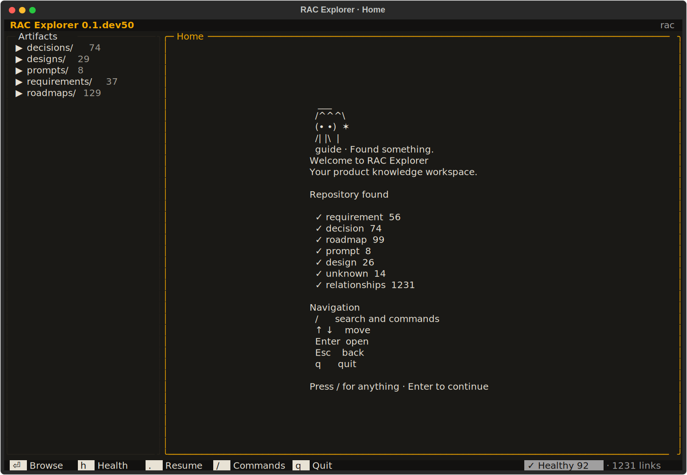
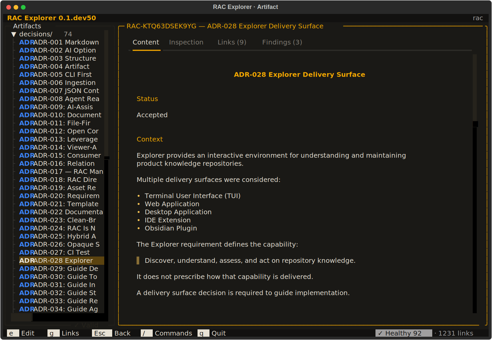
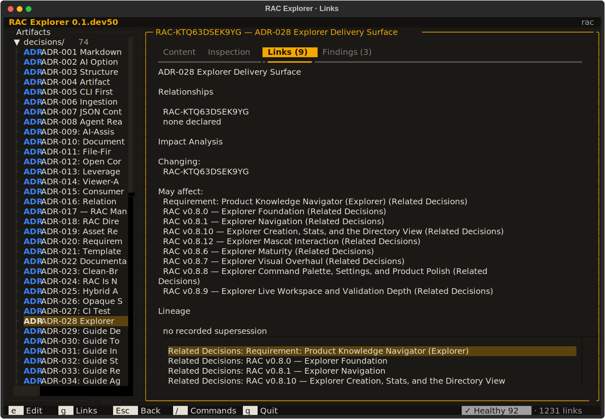
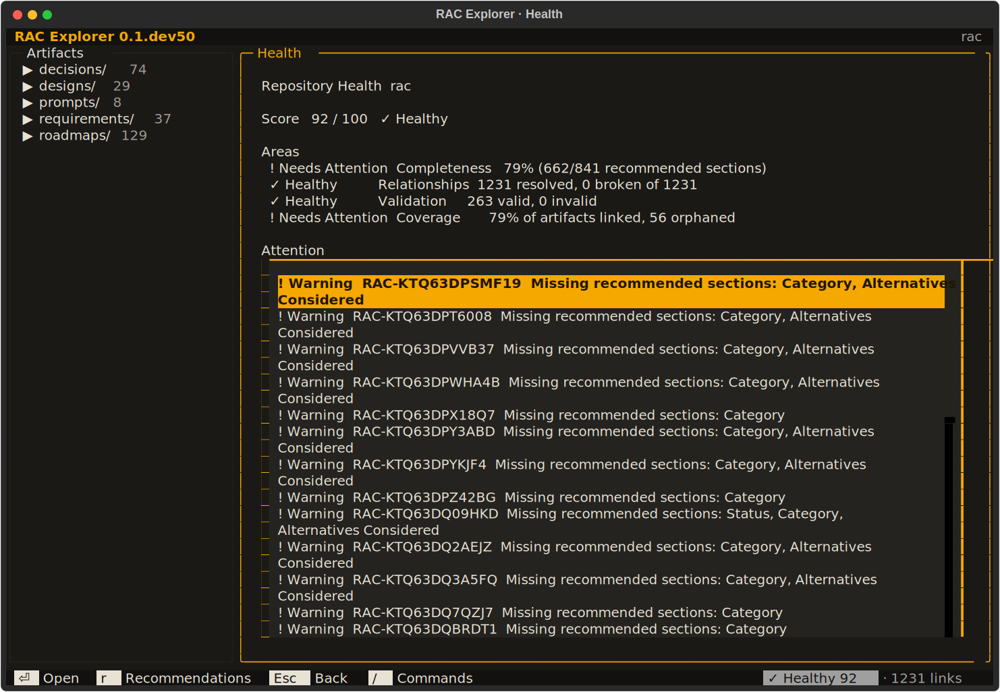
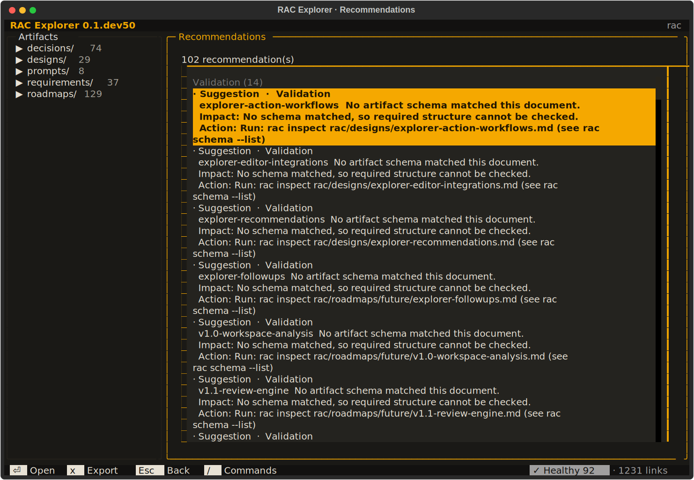
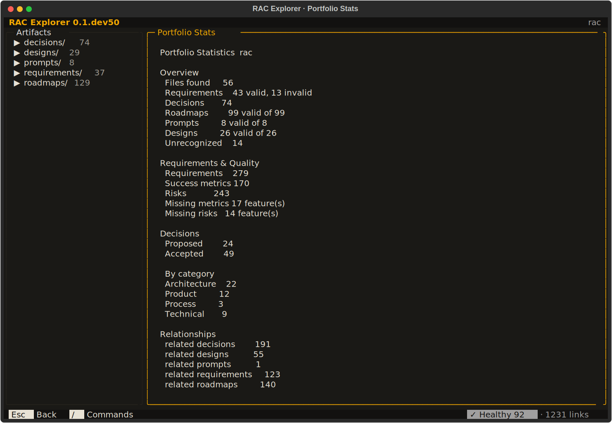
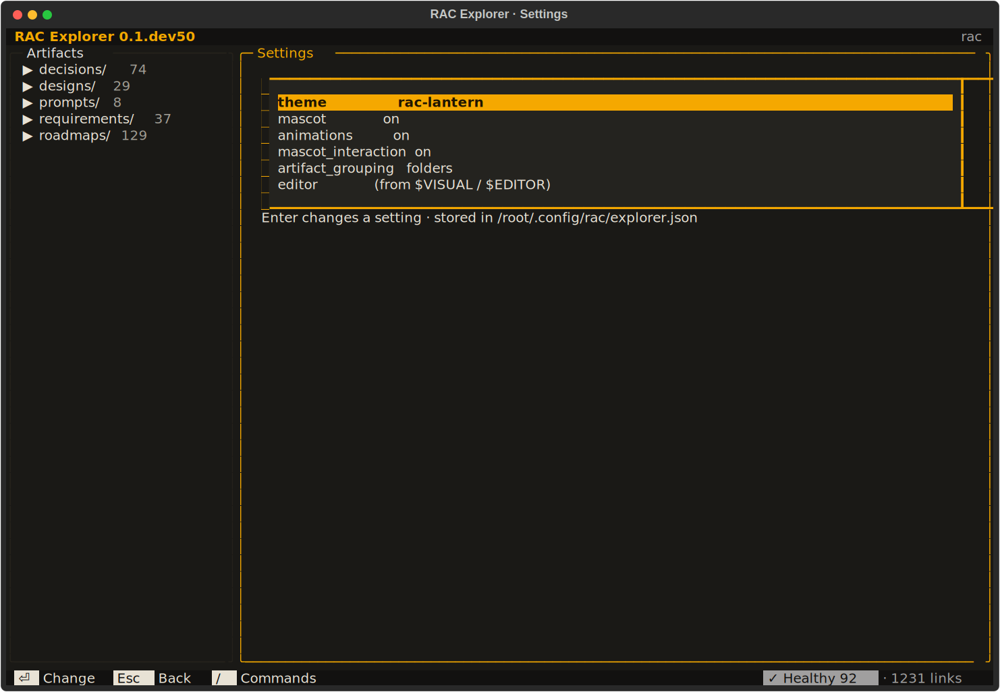
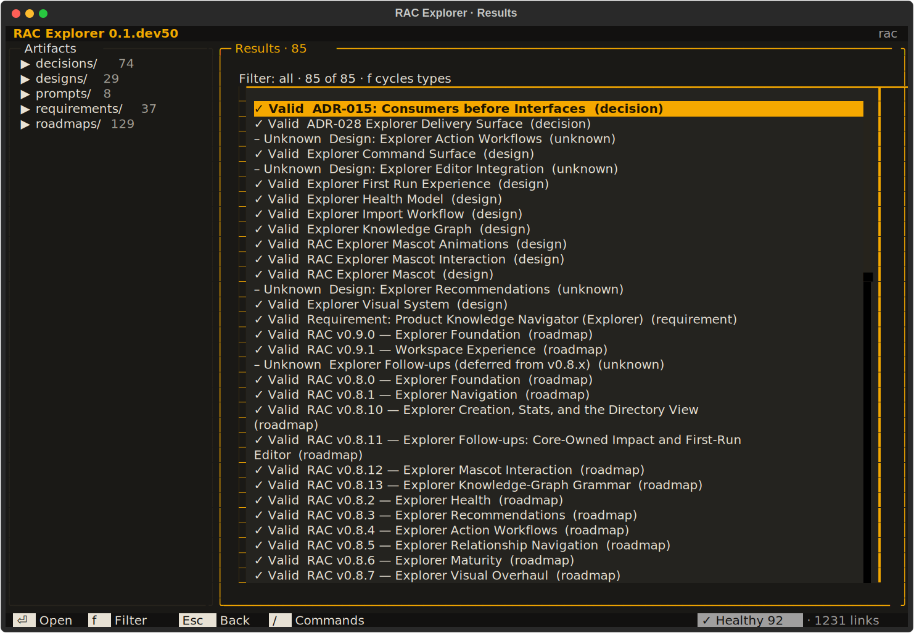
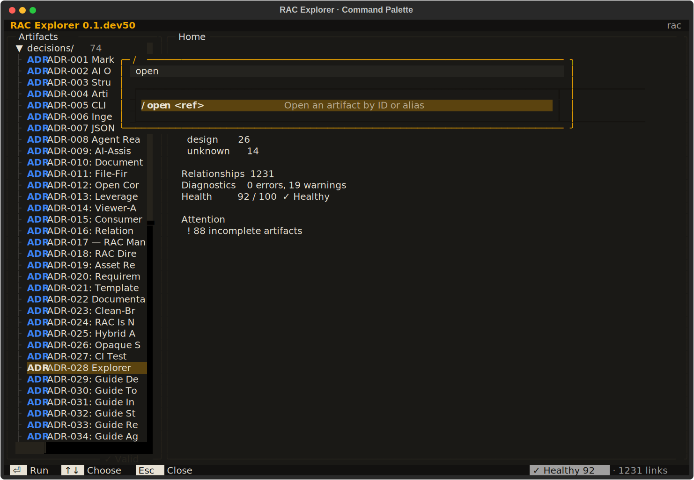
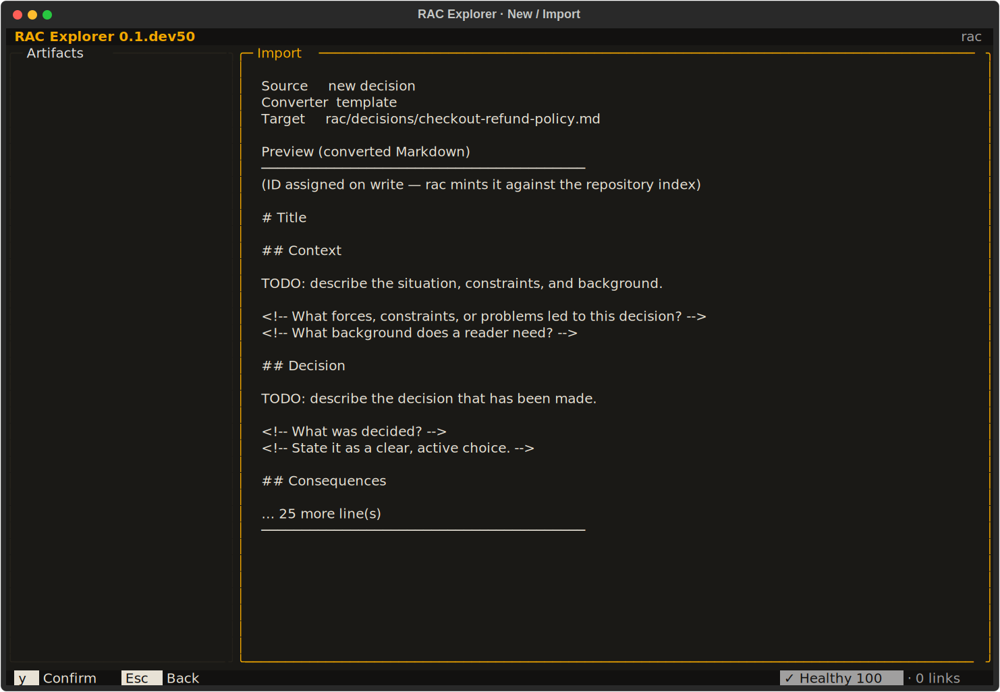

# RAC Explorer — Design System

A portable design-system reference for **RAC Explorer**, the terminal-native
knowledge workspace of RAC (requirements-as-code). Use this document as
context in Claude design tooling to generate interfaces, mockups, or
marketing surfaces that share the Explorer's visual language.

It is synthesised from the canonical design artifact
`rac/designs/explorer-visual-system.md` (RAC-KTQ63DT43E1Y) and the live
implementation tokens in `src/rac/explorer/`. Every value below is real.

> **One-line identity:** a calm, information-dense, keyboard-first developer
> tool — a hooded explorer carrying a single amber lantern through a
> near-black repository.



> The screenshots throughout are live `rac-lantern` renders of the running
> Explorer (Textual SVG exports), not mockups. A full panel gallery is in
> [§12](#12-panel-gallery).

---

## 1. Design principles

The Explorer's visual reference is **Posting** (posting.sh) and the **Textual
demo**, guided by five borrowed strengths:

| Principle | Source | What it means here |
| --- | --- | --- |
| **Information architecture** | GitHub | Stable regions; structure you can scan |
| **Spacing** | Linear | Generous-but-tight; whitespace as rhythm, not decoration |
| **Content focus** | Notion | The document itself is the hero; reading measure is capped |
| **Keyboard UX** | LazyGit | Every action has a key; context-sensitive hint chips |
| **Implementation** | Textual | Terminal-native, 256-colour safe, no GUI chrome |

Three rules override everything:

1. **Colour communicates focus, not meaning.** One accent. State is carried
   by icons, labels, and chips — never colour alone.
2. **One stable frame.** Views swap inside a single context region; the layout
   never jumps, nothing rebuilds.
3. **Never a dead-end.** `Esc` always has somewhere to go; empty and error
   states are calm, not alarming.

---

## 2. Colour tokens

The default theme is **`rac-lantern`**, derived from the Explorer mascot: a
hooded figure in warm amber on near-black, holding a lantern. The single
accent is that lantern amber.

### Core palette

| Token | Hex | Role |
| --- | --- | --- |
| `accent` / `primary` | `#F5A800` | Lantern amber — the **one** accent: focus, selection, the `/` glyph, app-bar title |
| `secondary` | `#D98E04` | Dimmer amber for secondary emphasis |
| `foreground` | `#E8E2D5` | Warm off-white body text |
| `background` (Surface 0) | `#121110` | Near-black app canvas |
| `surface` (Surface 1) | `#1A1916` | Panels |
| `panel` | `#26231C` | Muted panel borders, idle scrollbars |
| `success` | `#46A758` | Healthy / valid |
| `warning` | `#F5A800` | Caution (shares the amber accent) |
| `error` | `#E5484D` | Unhealthy / invalid |
| `text-muted` | derived | Repository path, counts, secondary labels |

`dark: true`. The theme is swappable — any Textual theme works — and **all
meaning survives any palette** because icons, labels, and chips carry state.

### Type tags (the only multi-hue system)

Each artifact type carries one fixed hue, **always rendered as a text tag
beside the title** so meaning never rides on colour alone:

| Type | Tag | Hue | Colour |
| --- | --- | --- | --- |
| Requirement | `REQ` | `#46A758` | green |
| Decision (ADR) | `ADR` | `#3B82F6` | blue |
| Roadmap | `RMP` | `#A855F7` | purple |
| Prompt | `PRM` | `#06B6D4` | cyan |
| Design | `DSG` | `#EC4899` | pink |
| Unknown | `UNK` | `bright_black` | grey |

Tags are bold, fixed-width, three letters. An invalid artifact carries a bold
`✗` beside the tag.

---

## 3. Surfaces & elevation

Three depth levels — depth is communicated by background and border, not
shadow:

| Level | Name | Treatment |
| --- | --- | --- |
| **Surface 0** | App background | `#121110`, flat canvas |
| **Surface 1** | Panel | `border: round` in `panel` (`#26231C`), `background: surface` (`#1A1916`), `padding: 1 2`, a titled top border |
| **Surface 2** | Focused panel | identical to Surface 1, but `border: round accent` and the border-title switches to accent |

Panels may carry a **one-line bottom-border status** (e.g. the sidebar showing
the selected artifact's status chip).

Borders are always **rounded** (`╭─╮ ╰─╯`). Titles sit inline on the top
border (`╭─ Artifacts ─╮`). Focus is the only thing that turns a border amber.

---

## 4. Typography & iconography

- **Monospace, terminal-native.** One typeface, cell-aligned. No font scale —
  hierarchy comes from weight, casing, spacing, and the accent.
- **Weight:** bold for the app-bar title, type tags, and panel titles; regular
  everywhere else.
- **Reading measure:** rendered Markdown content is **capped near 96 cells**
  and centred so prose stays readable in wide terminals (Notion content focus).
- **Icons are Unicode glyphs**, always paired with text:
  - `✓` valid / healthy · `!` warning / needs attention · `✗` invalid / error
  - `▸ ▾` tree disclosure · `⏎` enter · `⇥` tab · `↑ ↓` move · `·` separator
  - `/` the command-palette summon glyph (rendered in accent)

---

## 5. Spacing

Generous but tight:

| Rule | Value |
| --- | --- |
| Panel padding | `1 2` (1 row vertical, 2 cells horizontal) |
| Label column alignment | **12 cells** |
| Group separation | one blank line |
| Sidebar width | **28 cells** (fixed; hidden below 80 columns) |
| Content reading cap | **96 cells** |
| Command palette width | **80 cells** (max 90%), menu capped near 14 rows |
| App bar / status line height | **1 row** each |
| Scrollbars | **1 cell**, muted (`panel`); the accent never rides a scrollbar |

---

## 6. The canonical frame

One persistent workspace frame. Top to bottom: **app bar → workspace
(sidebar + context region) → status line.** Navigation only ever swaps the
context region.

```text
 RAC Explorer 0.8.8                                      ~/work/payments
╭─ Artifacts ─────────────╮╭─ REQ-004 — Checkout flow ───────────────╮
│ ▾ Requirements     12   ││ Content │ Inspection │ Links (3) │ Fin… │
│   REQ Checkout flow     ││                                         │
│   REQ Refund handling   ││  # Checkout flow                        │
│ ▸ Decisions         8   ││                                         │
│ ▸ Roadmaps          5   ││  ## Problem                             │
│ ▸ Prompts           7   ││  Retail investors struggle to…          │
│                         ││                                         │
╰─ ✓ Valid · 3 links ─────╯╰─────────────────────────────────────────╯
 ⏎ Open  ⇥ Panel  e Edit  h Health  / Commands     ✓ Healthy 92 · 84 links
```

Pressing `/` floats the command palette over the context region:

```text
      ╭─ / ────────────────────────────────────────────────╮
      │ open chec_                                          │
      │                                                     │
      │  /open <ref>      Open an artifact by ID or alias   │
      │  REQ Checkout flow                ✓ Valid           │
      │  Enter searches for 'open chec'                     │
      ╰─────────────────────────────────────────────────────╯
```

---

## 7. Components

### App bar
One plain line. **No stock header chrome.** Application name + version in the
accent colour, bold, left-aligned; repository path muted, right-aligned.

### Navigation sidebar
Titled rounded panel (`Artifacts`), fixed 28 cells, **hidden below 80
columns** so reading width is preserved. Hosts the artifact tree, which
**mirrors the repository directory structure by default** (directory rows show
`name/` + a dim count; type and flat groupings are settings). Artifact rows:
`TAG  Title` (ID only when untitled), invalid rows carry `✗`. Selected row is
the accent at 30% behind the text. Bottom border shows the selected artifact's
status chip.

### Context panel
Titled rounded panel hosting **exactly one view at a time**: home, artifact
context, health, recommendations, import, results, settings, stats. When an
artifact is open, the panel title is its `ID — title`. Artifact view tabs:

```text
Content │ Inspection │ Links │ Findings
```

- **Content** (default) — the document's Markdown, **read-only**, capped at 96
  cells. References in the text are **navigable**: activating one opens the
  target in place; `Esc` walks back through history.
- **Inspection** — status, completeness, diagnostics.
- **Links** — relationships, impact, lineage (count badge when populated).
- **Findings** — recommendations for this artifact (count badge when populated).

Editing belongs to **external tools** — the Explorer renders knowledge, it
does not edit it.

### Command palette
Summoned by `/`, **hidden when idle** (the frame carries no input chrome).
Titled rounded panel on its own layer, ~80 cells, centred, `margin-top: 3`.
Input on top (borderless), live suggestion menu below (≤14 rows). Suggestions
mix command specs (`/open <ref>   Open an artifact by ID or alias`) with live
artifact rows that carry their type tag and a status chip.

### Status line
One row. **No stock footer.** Left: context-sensitive **key chips** for the
focused region (inverse-video `▌ key ▐  Label`). Right: the repository health
chip + link count, muted. The `/` chip always advertises the palette. Hints
live only in chips, never duplicated as panel text.

### Status chips
Short **inverse-video** chips, one casing everywhere, symbol + text:

```text
✓ Valid          ✓ Healthy        ! Needs Attention
! 2 Warnings     ✗ Unhealthy      ✗ Error
```

Health bands: `score ≥ 80 → ✓ Healthy`, `≥ 50 → ! Needs Attention`,
`else → ✗ Unhealthy`.

### Confirm-write modal
The **only** screen-stack surface (everything else swaps in place). A titled
rounded `accent`-bordered panel (80% × 80%) over the dimmed frame, with key
chips matching the status line.

---

## 8. The mascot

A small **hooded explorer carrying a lantern** — navigation that illuminates
hidden product knowledge. It is **identity, never a feature**: it gates
nothing and modifies nothing.

```text
   ___
  /^^^\
  (• •)  ◆      guide · Ready to explore.
  /| |\  |
```

- The **lantern glyph animates** (the figure holds steady); the eyes blink.
- Six states, each a frame sequence, each carrying **equivalent text** so
  disabling animation (first frame) or the mascot entirely (text only) loses
  no information:

  | State | Lantern | Label |
  | --- | --- | --- |
  | idle | `◇ ◆ ◇` | Ready to explore. |
  | searching | `◈ ◇ ◆` | Searching… |
  | discovery | `✶ ✦ ✶` | Found something. |
  | success | `✓` | Done. |
  | empty | `○ ◌` | Nothing here yet. |
  | error | `✗` | Something went wrong. |

- Caption is always `guide · <label>`.
- **Tone:** calm, encouraging, terse. Rewards curiosity (selecting it returns
  small acknowledgements that point at real commands) without ever
  interrupting work.

---

## 9. Interaction & keyboard model

**Keyboard-first; the pointer is optional.**

- **`/`** — summon the command palette from anywhere (the primary verb).
- **`Esc`** — dismiss palette → step back through context history → return
  home. Never a dead-end.
- **`Tab` / `⇥`** — cycle panels.
- **`?`** — command help.
- **Single-letter shortcuts** (`h` Health, `r` Reload/Recommendations,
  `e` Edit, `.` Resume, `q` Quit) — **suspended while the palette input has
  focus** so typing always wins.
- Hints are **context-sensitive**: the status line shows only the keys that
  matter in the focused region.

Motion is calm: views fade/swap in place, loading is **one line of phase +
count**, empty results show the mascot's empty state.

---

## 10. Accessibility & constraints

- **No colour-only meaning.** Validation = icon **+** label **+** colour.
  Type tags and key chips always carry text. Disabling colour loses nothing.
- **256-colour fallback**; broad terminal compatibility.
- **One stable frame** — the layout never jumps.
- **No stock Textual Header or Footer** — bespoke app bar and status line.
- **Read-only content** — editing is delegated to external editors.

---

## 11. Using this in Claude design

When prompting Claude design tooling, anchor on these so output stays on-brand:

- **Palette:** near-black canvas (`#121110`), warm off-white text (`#E8E2D5`),
  **one** amber accent (`#F5A800`). Reserve the accent for focus and the brand
  mark — do not spread it across the UI.
- **Shape language:** rounded-rectangle panels with inline titles on the top
  edge; depth via three flat surface levels, **no drop shadows**.
- **Type tags** are the only place multiple hues appear, and they are always
  text + colour.
- **Voice:** calm, terse, developer-tool confident. "Found something." not
  "Congratulations!". The lantern mascot is the friendly face; everything else
  is quiet.
- **Density:** information-dense but never cramped — 12-cell label columns,
  blank-line group breaks, capped reading width.
- **Translating to web/visual:** map cells to an 8px grid (1 cell ≈ 8px),
  monospace → a mono display face (e.g. a Berkeley/JetBrains-mono register),
  inverse-video chips → small filled pill badges, rounded ASCII borders → 1px
  rounded borders in the `panel` colour that turn amber on focus.

---

## 12. Panel gallery

Live `rac-lantern` renders of every panel, captured headlessly from the
running Explorer (120×40 cells). Use these as visual ground truth when
recreating the interface.

### Home — first-run welcome

The mascot, the repository summary, and the navigation key map. Onboarding is
a calm overlay, never forced setup.


### Artifact — Content tab

The signature view: an artifact open on its rendered Markdown, the tab strip
(`Content │ Inspection │ Links │ Findings`), the sidebar revealing the file,
the panel title as `ID — title`, the status chip below the sidebar.



### Artifact — Links tab

Relationships, impact analysis, and lineage — the graph around an artifact.



### Health

Repository score, per-area breakdown, and the attention list of findings.



### Recommendations

Prioritised findings with impact and the action that resolves each one.



### Portfolio Stats

The numbers behind the corpus — counts, quality, decision status, relationships.



### Settings

Explorer preferences (theme, grouping, mascot, animations, editor) — every
setting carries a text label and a current value.



### Results — search

Filterable result rows, each with its type tag and status chip; the panel
title carries the count.



### Command palette

Summoned by `/`, floated over the context region on its own layer, input on
top and live suggestions below (here filtered to `/open`).



### New / Import — preview

The guided write workflow: source, converter, and target up top, a Markdown
preview below, and a `y Confirm` chip. Nothing is written until confirmed, and
writes never overwrite.



---

*Source of truth: `rac/designs/explorer-visual-system.md` (RAC-KTQ63DT43E1Y),
`rac/designs/explorer-mascot*.md`, and `src/rac/explorer/` (theme.py,
explorer.tcss, widgets/). Decisions: ADR-028 (Explorer delivery surface),
ADR-024 (single screen-stack surface), ADR-015 (adapter boundary).*
