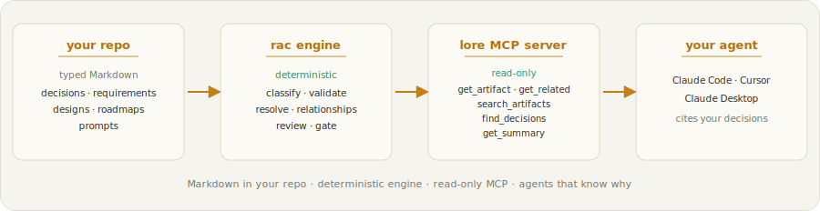

# Lore

<!-- mcp-name: io.github.tcballard/lore -->

<picture>
  <source media="(prefers-color-scheme: dark)" srcset="https://raw.githubusercontent.com/itsthelore/rac-core/main/rac/assets/images/lore-header-dark.png">
  <source media="(prefers-color-scheme: light)" srcset="https://raw.githubusercontent.com/itsthelore/rac-core/main/rac/assets/images/lore-header-light.png">
  
</picture>

<p align="center">
<a href="#quickstart">Quickstart</a> ·
<a href="#how-it-compares">How it compares</a> ·
<a href="#how-it-works">How it works</a> ·
<a href="https://itsthelore.github.io/rac-core/">Docs</a> ·
<a href="https://itsthelore.github.io/rac-core/cli/">CLI</a> ·
<a href="https://github.com/itsthelore/rac-core/blob/main/CHANGELOG.md">Changelog</a>
</p>

<p align="center">
<a href="https://github.com/itsthelore/rac-core/actions/workflows/ci.yml"></a>
<a href="https://pypi.org/project/requirements-as-code/"></a>
<a href="https://pypi.org/project/requirements-as-code/"></a>
<a href="https://mypy-lang.org/"></a>
<a href="https://github.com/itsthelore/rac-core/blob/main/LICENSE"></a>
</p>

> **Give your coding agent the decisions your team already made — so it stops re-doing things you ruled out.**

Lore keeps your team's recorded knowledge — requirements, decisions, designs, roadmaps, and prompts — as typed Markdown in your repo and serves it **read-only** to Claude Code, Cursor, and Claude Desktop over MCP, so the agent cites your decisions instead of violating them. No RAG, no embeddings, no model call to decide what's relevant — retrieval is deterministic and reproducible. It is built on **RAC — Requirements as Code**, the open-source engine underneath; the package, CLI, and MCP server ship under the `rac` name.

## How it compares

Lore isn't a search index or a memory tool — it's the **deterministic system of
record** an agent grounds against. Fuzzy retrieval (RAG, agent memory) is good at
finding *what's near* a loose question; Lore is good at returning the *exact,
current* decision and declining the ones you've superseded. They compose well —
recall fuzzily, then verify in Lore.

| | Lore | Fuzzy retrieval (RAG / agent memory) |
|---|---|---|
| Good at | the exact, current decision | finding what's *near* a question |
| Retrieval | deterministic, reproducible | similarity-ranked, varies by run |
| Role | source of truth, read-only | a fast index or working copy |
| In CI | enforced (`rac validate` / `rac gate`) | not its job |

## Quickstart

1. **Install** the engine:

   ```bash
   pip install requirements-as-code
   ```

2. **Scaffold** identity and your first artifact:

   ```bash
   rac quickstart
   ```

3. **Connect your agent** (Claude Code, from your repo root):

   ```bash
   claude mcp add lore -- rac mcp
   ```

4. **Enforce** in CI so bad knowledge never lands:

   ```bash
   rac validate rac/ && rac gate rac/
   ```

## Install

| Command | Gets you |
|---|---|
| `pip install requirements-as-code` | the `rac` CLI + the `lore` MCP server |
| `pip install 'requirements-as-code[ingest]'` | + DOCX / HTML import |
| `pip install 'requirements-as-code[ingest-all]'` | + PDF / PPTX / XLSX import |
| `pip install 'requirements-as-code[explorer]'` | + the terminal Explorer (`rac explorer`) |

Requires Python 3.11+. `uv tool install requirements-as-code` also works.

## How it works

<p align="center">
<picture>
  <source media="(prefers-color-scheme: dark)" srcset="rac/assets/images/lore-how-it-works-dark.svg">
  <source media="(prefers-color-scheme: light)" srcset="rac/assets/images/lore-how-it-works-light.svg">
  
</picture>
</p>

- **Typed Markdown, in your repo.** Every artifact is plain Markdown with a tiny
  frontmatter envelope; the engine classifies it deterministically and validates
  it against a per-type schema.
- **Read-only at serve time.** The MCP server only ever reads; the trust boundary
  is human PR review, and the agent cannot mutate the store.
- **Enforced at write time.** `rac validate` and `rac gate` reject malformed
  artifacts, broken or ambiguous links, and references to superseded decisions —
  in CI, before the knowledge lands.
- **Air-gapped by design.** The engine makes no LLM calls and no network calls;
  the only egress is a consent-gated, content-free usage ping that is off by
  default, and regulated installs can prove it stays off with `rac telemetry off
  --enterprise` ([security posture](docs/security.md), ADR-086).

## Connect your agent

Claude Code (from your repo root):

```bash
claude mcp add lore -- rac mcp
```

Claude Desktop / Cursor (`mcpServers` in the client config):

```json
{
  "mcpServers": {
    "lore": { "command": "rac", "args": ["mcp", "--root", "/absolute/path/to/your/repo"] }
  }
}
```

## Author and enforce artifacts

```bash
rac quickstart             # set up identity + scaffold your first artifact
rac new decision adr.md    # scaffold a typed artifact (mints the id)
rac validate rac/          # check every artifact in a directory
rac inspect requirement.md # see its type and completeness
rac review rac/            # full repository review, worst problems first
rac gate rac/              # the merge gate: validate + relationships + review
```

## Import an existing decision

Already have decisions in Confluence, Notion, or loose Markdown? The `rac-import`
agent skill turns **one** existing document into **one** valid artifact, with a
human-review step before anything is written:

```bash
rac skill install rac-import
```

Then ask your agent, in plain language: *"import this decision doc into Lore."* It
drafts from **only** what your document says, shows you the proposed type, title,
and relationships to confirm, scaffolds with `rac new`, and closes on
`rac validate`. For multi-format or bulk conversion, use the `rac-ingest` skill.

## Export the corpus

```bash
rac export rac/ --html --out lore.html   # the Portal: the whole graph, one file
rac export rac/ --okf                    # a conformant Open Knowledge Format bundle
rac export rac/ --documents              # JSONL for memory/RAG backends
rac export rac/ --graph                  # the typed decision graph for graph backends
```

The `--documents` and `--graph` modes feed external memory, RAG, and graph tools
so an agent can recall fuzzily there and then **verify in Lore** — see the
[CLI reference](https://itsthelore.github.io/rac-core/cli/#export). The connectors
themselves live in the separate `lore-connectors` companion.

## Python API

The engine is a library too; its public surface is `rac.__all__`.

```python
from rac import parse_file, classify, find_artifacts

art = parse_file("rac/decisions/adr-001-markdown-first.md")
print(classify(art).type)                  # -> "decision"

result = find_artifacts("rac/", "caching")  # returns a SearchResult
for hit in result.matches:
    print(hit.id, hit.title)
```

## How it relates to OKF

Google's Open Knowledge Format (OKF) standardises the *carrier* — a Git tree of
Markdown with YAML front matter — and is deliberately permissive. RAC writes that
same carrier and adds what OKF leaves to the consumer: **write-time enforcement**
in CI. `rac validate` and `rac relationships --validate` reject malformed
artifacts, broken links, and references to superseded decisions, deterministically,
before the knowledge lands. `rac export --okf` turns any RAC repo into a conformant
OKF bundle — so the two compose rather than compete.

## Who it's for

- **Teams running coding agents heavily** (Claude Code, Cursor) tired of the agent ignoring decisions the team already made.
- **Teams who already write ADRs** and want those decisions to actually shape what the agent does.
- **Anyone who wants the *why* behind their software versioned alongside the code.**

## Documentation

**Full documentation: <https://itsthelore.github.io/rac-core/>**

- [Quickstart](https://itsthelore.github.io/rac-core/quickstart/) — install and author your first artifact
- [MCP server](https://itsthelore.github.io/rac-core/mcp/) — tools, client configuration, examples
- [CLI reference](https://itsthelore.github.io/rac-core/cli/) — every command, flag, and exit code

## Origin

Lore is the product surface of **RAC — Requirements as Code**, the open-source
engine underneath; the package, CLI, and MCP server ship under the `rac` name, and
`lore` is the server identity and brand.
[Wayfinder](https://github.com/itsthelore/wayfinder-router), the deterministic
prompt-complexity router, began as a `route` experiment inside RAC and was split
into its own tool — routing is a runtime concern, not a knowledge one.

## Repository layout

```text
rac-core/
  src/rac/        the engine: CLI, core, services, output, the in-process MCP
                  server (rac mcp), and bundled skills, templates, and git hooks
  rac/            the dogfood corpus — requirements, decisions, designs, roadmaps,
                  and prompts that govern the project itself
  tests/          per-service batteries plus core / cli / artifacts coverage (ADR-027)
  docs/           the documentation site (MkDocs)
  examples/       the grounding demo, woven into the corpus and the test fixtures
  rac-localview/  the Portal / graph viewer, vendored into the engine
```

## Test

```bash
pip install -e .[dev]
python -m pytest
```

`ruff check`, `ruff format --check`, and `mypy src/` run in CI alongside the
per-service batteries (ADR-027).

## Project status

Lore is early and evolving quickly. The MCP server ships today. Contributions,
ideas, and experiments welcome — see [CONTRIBUTING.md](https://github.com/itsthelore/rac-core/blob/main/CONTRIBUTING.md).

## License

[Apache License 2.0](LICENSE).
