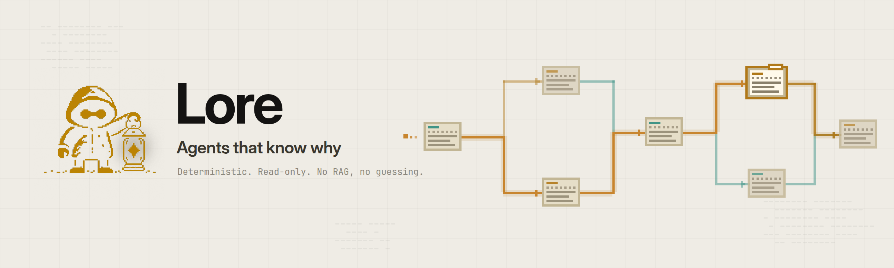
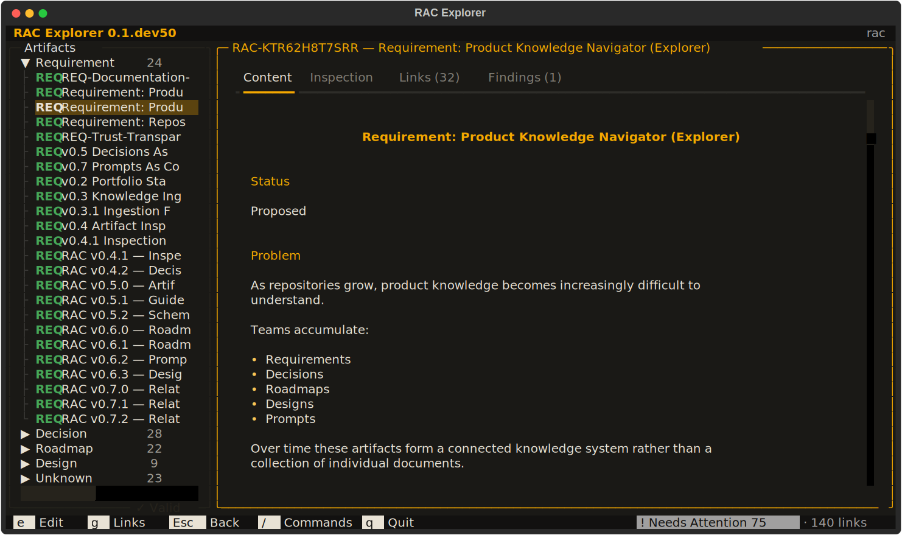

# Requirements as Code

<picture>
  <source media="(prefers-color-scheme: dark)" srcset="rac/assets/images/lore-header-dark.png">
  <source media="(prefers-color-scheme: light)" srcset="rac/assets/images/lore-header-light.png">
  
</picture>

[](https://github.com/tcballard/requirements-as-code/actions/workflows/ci.yml)
[](https://pypi.org/project/requirements-as-code/)

> **Treat product knowledge like source code.**

RAC is a command-line tool for managing requirements, decisions, roadmaps, prompts,
and design artifacts as plain Markdown, right inside your Git repository.

```bash
pip install requirements-as-code
```

## What is RAC?

The code is structured, the tests are automated, the infrastructure is versioned —
but the *reasoning* behind what you build is scattered across documents, tickets,
chats, and AI conversations. RAC brings that knowledge back into the repository.

You write product thinking in Markdown; RAC validates it, inspects it, and connects
it — so it stays durable, reviewable, and usable as context for both humans and AI.
No proprietary formats, no hosted platform, no lock-in.

## Who is it for?

- **Software and product teams** who want the *why* behind their software versioned
  alongside the code.
- **AI-native teams** who need structured, durable context instead of more scattered
  chat history.

## Install

Requires Python 3.11+.

```bash
pip install requirements-as-code
# or
uv tool install requirements-as-code
```

## Quick Start

```bash
rac validate requirement.md   # check one artifact
rac validate rac/             # check every artifact in a directory
rac inspect requirement.md    # see its type and completeness
rac stats rac/                # summarize a directory of artifacts
rac review rac/               # full repository review, worst problems first
```

New to RAC? Walk through your first artifact in five minutes:
**[docs/quickstart.md](docs/quickstart.md)**.

## Supported Artifact Types

- **Requirements** — what needs to exist
- **Decisions** — why choices were made (ADRs)
- **Roadmaps** — where the product is heading
- **Prompts** — reusable AI collaboration patterns
- **Designs** — product experience thinking

Everything stays plain Markdown — see **[docs/artifacts.md](docs/artifacts.md)**.

## Documentation

- [Quickstart](docs/quickstart.md) — install and try RAC in five minutes
- [CLI reference](docs/cli.md) — every command, flag, and exit code
- [Artifact types](docs/artifacts.md) — the five types and their sections
- [Relationships](docs/relationships.md) — link artifacts and validate the links
- [Repository workflow](docs/repo-workflow.md) — organize a repo with RAC
- [Guide (MCP server)](docs/mcp.md) — connect coding agents to your repository
- [Testing & contributing](docs/testing.md) — local setup and verification
- [Examples](docs/examples.md) — small, realistic artifacts

## RAC Guide — MCP server for coding agents

RAC Guide is an MCP server that serves your repository's requirements,
decisions, designs, and roadmaps to coding agents as callable tools, so
recorded decisions are respected instead of rediscovered. A single
`pip install` is all that is needed — no separate package, no extra flag.

```bash
rac mcp                   # serve the current directory
rac mcp --root path/to/repo
```

### Configure your client

**Claude Code**

```bash
claude mcp add rac-guide -- rac mcp --root /path/to/your/repo
```

Or add to `.mcp.json` in your project root:

```json
{
  "mcpServers": {
    "rac-guide": {
      "command": "rac",
      "args": ["mcp", "--root", "/path/to/your/repo"]
    }
  }
}
```

<!-- TODO: verify against Claude Code <version> before release -->

**Claude Desktop** — add to `claude_desktop_config.json`:

```json
{
  "mcpServers": {
    "rac-guide": {
      "command": "rac",
      "args": ["mcp", "--root", "/path/to/your/repo"]
    }
  }
}
```

<!-- TODO: verify against Claude Desktop <version> before release -->

**Cursor** — add to `.cursor/mcp.json` in your project:

```json
{
  "mcpServers": {
    "rac-guide": {
      "command": "rac",
      "args": ["mcp", "--root", "/path/to/your/repo"]
    }
  }
}
```

<!-- TODO: verify against Cursor <version> before release -->

Want to try Guide against a ready-made corpus before pointing it at your own
repository? See **[examples/guide/](examples/guide/)**.

Full onboarding path, troubleshooting, and first-question walkthrough:
**[docs/mcp.md](docs/mcp.md)**.

## How RAC earns trust

RAC asks you to trust it with your product knowledge, so it holds itself to the
same standard it applies to your repository:

- **It dogfoods itself.** RAC's own planning corpus under [`rac/`](rac/) is
  validated by RAC in CI (`rac validate rac/`, `rac relationships rac/ --validate`,
  `rac review rac/`) — if the tool's rules break the tool's own artifacts, the
  build fails.
- **Output is a contract.** Golden tests pin the CLI's human and JSON output
  byte-for-byte; any change to what RAC prints is reviewed as a product change.
- **JSON is versioned.** Machine-readable output carries a `schema_version` and
  only changes additively.

## Project Status

RAC is early and evolving quickly. A terminal Explorer ships alongside the
CLI — browse the artifact tree, read documents with their references as
navigable links, assess repository health, and reach anything from the `/`
command palette:



```bash
pip install 'requirements-as-code[explorer]'
rac explorer
```

Contributions, ideas, and experiments are welcome — see
[CONTRIBUTING.md](CONTRIBUTING.md).

## License

MIT
